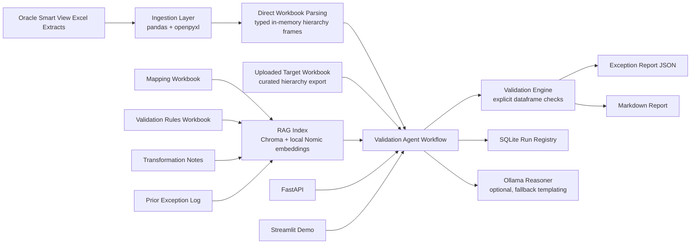

# Architecture

## Flow

1. Uploaded source and target workbooks are parsed directly into in-memory hierarchy frames, mappings, and rules.
2. Mapping records, rules, transformation notes, and prior exceptions are embedded into a Chroma index using the local `nomic-ai/nomic-embed-text-v1.5` model by default.
3. The agent retrieves relevant context, chooses enabled rules for each dimension, and runs explicit validation checks.
4. Results are saved as JSON and markdown reports, while SQLite stores report metadata for lookup by run ID.

## Design Notes

- The validation layer is rule-based and inspectable so business logic stays transparent.
- RAG augments explanations and rule selection context instead of replacing deterministic checks.
- Ollama is optional at runtime; the app falls back to template-based business summaries when the local model is unavailable.
